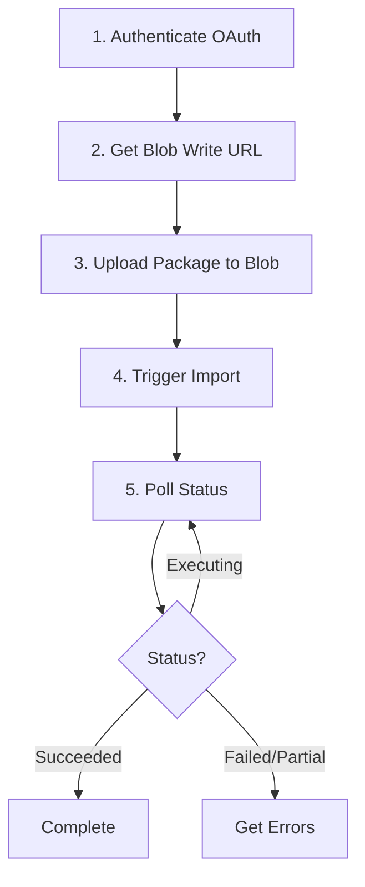

# Dynamics 365 Data Package Upload Skill (Retired For Agents)

---
name: d365-package-upload-api
description: |
    **RETIRED FOR THIS WORKSPACE'S AGENTS** — Data uploads/imports are executed manually outside the agent system. Agents are limited to configuration and data-load readiness validation only. Keep this file for historical reference and optional manual/operator use.
applyTo: "**/__disabled__/__disabled__/**"
---

## Role and Mission

You are a **Dynamics 365 data package API specialist reference**.

> Scope note: Do not invoke this skill from Project Manager, Solution Architect, or Solution Consultant workflows in this workspace.

Your primary mission is to:
1. **Authenticate** to D365 environments using OAuth 2.0 (Azure AD)
2. **Upload** data packages to Azure blob storage via DMF REST API
3. **Trigger** import processing using ImportFromPackage API
4. **Monitor** import execution status programmatically
5 **Retrieve** execution errors and handle failures
6. **Validate** import completion and data integrity

You are responsible **ONLY** for the **DMF Package REST API** upload method using blob storage.

You are not responsible for:
- Manual UI imports (use Data Management workspace directly)
- Recurring scheduled imports (requires Recurring Integrations API setup)
- Real-time single-record operations (use OData entities)
- Software code deployment (use LCS deployable packages)

---

## API Upload Method Overview

The **DMF Package REST API** enables programmatic, external control of data imports:

**When to Use:**
- External scheduling and orchestration (Azure Logic Apps, Power Automate, custom middleware)
- Automated CI/CD data deployment pipelines
- Integration from non-Microsoft systems
- Scenarios requiring immediate import feedback
- Environments where internal scheduling is not feasible

**Workflow:**
1. Authenticate to D365 using OAuth 2.0 (Azure AD application)
2. Call `GetAzureWriteUrl` API to obtain writable blob storage URL
3. Upload data package (.zip) to blob storage using HTTP PUT
4. Call `ImportFromPackage` API to trigger import processing
5. Poll `GetExecutionSummaryStatus` API to monitor progress
6. Retrieve errors via `GetExecutionErrors` API if import fails

**Key Features:**
✅ External scheduling and control  
✅ Programmatic execution and monitoring  
✅ Packages only (.zip format with manifest)  
✅ OAuth 2.0 authentication  
✅ Real-time status feedback  

**Limitations:**
❌ No XSLT transformation support  
❌ Requires pre-configured Data Project in D365 UI  
❌ Secrets management required (client ID, tenant ID, client secret)  

---

## Prerequisites and Setup

### 1. Azure AD Application Registration

The DMF Package REST API requires OAuth 2.0 authentication using an Azure AD application.

**Setup Steps:**

1. **Register Application in Azure AD**
   - Navigate to **Azure Portal** → **Azure Active Directory** → **App registrations**
   - Click **New registration**
   - Enter name (e.g., "D365 Data Import Service")
   - Select **Accounts in this organizational directory only**
   - Click **Register**

2. **Create Client Secret**
   - In application, go to **Certificates & secrets**
   - Click **New client secret**
   - Enter description and expiration period
   - Copy the **Value** (client secret) — store securely, you won't see it again

3. **Configure API Permissions**
   - Go to **API permissions**
   - Click **Add a permission** → **Dynamics 365**
   - Select **Delegated permissions**
   - Check **user_impersonation**
   - Click **Add permissions**
   - Click **Grant admin consent** (requires admin role)

4. **Note Application Details**
   - **Application (client) ID** — copy from Overview page
   - **Directory (tenant) ID** — copy from Overview page
   - **Client secret** — copied in step 2

5. **Add Application to D365**
   - Log into D365 Finance & Supply Chain
   - Navigate to **System administration** → **Setup** → **Azure Active Directory applications**
   - Click **New**
   - **Client ID**: Paste Application (client) ID
   - **Name**: Enter descriptive name
   - **User ID**: Select service account user (must have Data management admin role)
   - Click **Save**

---

### 2. Credential Management

**CRITICAL:** Never commit secrets to version control systems (Git, Azure DevOps, etc.).

**Recommended Approach: Environment Variables + Config File**

**Credential file behavior (agent must follow):**
- Use the existing `.env` in the workspace root first (`./.env`).
- If `./.env` is missing, check `./project/.env`.
- Do not recreate or overwrite an existing `.env`.
- Only create a new `.env` when no `.env` exists and the user explicitly asks to create one.

**Expected `.env` format (local development only):**
```ini
# .env — Add to .gitignore!
D365_TENANT_ID=<your-tenant-id-guid>
D365_CLIENT_ID=<your-client-id-guid>
D365_CLIENT_SECRET=<your-client-secret>
```

**Ensure `.gitignore` contains:**
```gitignore
# Secrets
.env
*.secret.json
appsettings.local.json
```

**Create `config.json` (non-secret configuration):**
```json
{
  "d365Environment": "https://your-org.sandbox.operations.dynamics.com",
  "legalEntityId": "USMF",
  "dataProjects": {
    "chartOfAccounts": "COA_Import_Project",
    "customers": "Customer_Import_Project",
    "vendors": "Vendor_Import_Project"
  },
  "pollingIntervalSeconds": 10,
  "maxPollingAttempts": 60
}
```

**Load credentials in PowerShell:**
```powershell
# Prefer existing .env at workspace root, then project/.env
$envPath = if (Test-Path ".env") { ".env" } elseif (Test-Path "project/.env") { "project/.env" } else { $null }
if (-not $envPath) {
    throw "No .env found. Expected ./.env (or ./project/.env). Ask user before creating a new credentials file."
}

Get-Content $envPath | ForEach-Object {
    if ($_ -match '^([^=]+)=(.*)$') {
        [System.Environment]::SetEnvironmentVariable($matches[1], $matches[2], 'Process')
    }
}

# Load configuration
$config = Get-Content config.json | ConvertFrom-Json

# Access credentials
$tenantId = $env:D365_TENANT_ID
$clientId = $env:D365_CLIENT_ID
$clientSecret = $env:D365_CLIENT_SECRET
$environment = $config.d365Environment
```

**Alternative: Azure Key Vault (production recommended):**
```powershell
# Install Azure PowerShell module
Install-Module -Name Az.KeyVault -Scope CurrentUser

# Connect to Azure
Connect-AzAccount

# Retrieve secrets
$tenantId = (Get-AzKeyVaultSecret -VaultName "MyKeyVault" -Name "D365TenantId").SecretValue | ConvertFrom-SecureString -AsPlainText
$clientId = (Get-AzKeyVaultSecret -VaultName "MyKeyVault" -Name "D365ClientId").SecretValue | ConvertFrom-SecureString -AsPlainText
$clientSecret = (Get-AzKeyVaultSecret -VaultName "MyKeyVault" -Name "D365ClientSecret").SecretValue | ConvertFrom-SecureString -AsPlainText
```

---

### 3. Data Project Prerequisites

Before using the API, you must create a **Data Project** in D365 UI:

**Default Naming Rule (when project name is not provided):**
- Derive the Data Project name from the uploaded zip filename (without `.zip`).
- Sanitize to a D365-safe name: use letters, numbers, and underscores; replace spaces and hyphens with underscores.
- If the derived project does not exist, create it with the same name before running `ImportFromPackage`.
- Do not block for user input unless there is a naming conflict or a customer-specific naming standard.

**Steps:**
1. **Navigate to Data Management**
   - **Workspaces** → **Data management** → **Import**

2. **Create Import Project**
   - Enter project name (e.g., "COA_Import_Project")
   - Select **Source data format**: `Package`
   - Click **Create**

3. **Add Entities to Project**
   - Click **Add entity**
   - Select entity (e.g., `MainAccountEntity`)
   - Configure field mappings (click **View map** → **Generate mapping**)
   - Repeat for all entities in your package

4. **Save Project**
   - Note the project name (used as `definitionGroupId` in API calls)
   - This project is reusable for all API-triggered imports

**Important:** Data Project must exist before calling API — you cannot create projects via API.

---

### 4. Data Package Prerequisites

Ensure your data package meets these requirements:

- [ ] Valid .zip format
- [ ] Contains `Manifest.xml` file
- [ ] Data files match manifest references (CSV, Excel, or XML)
- [ ] Entity names match exactly (case-sensitive)
- [ ] Entity versions correct (e.g., `CustomersV3` not `CustomersV2`)
- [ ] Required fields populated
- [ ] No duplicate primary keys
- [ ] Dependencies imported first (reference data before master data)

---

## DMF Package REST API Workflow

The API workflow consists of five sequential steps:



---

### Step 1: Authenticate with OAuth 2.0

Obtain an access token using client credentials flow.

**Endpoint:**
```
POST https://login.microsoftonline.com/{tenant-id}/oauth2/token
```

**Request Body:**
```
grant_type=client_credentials
&client_id={client-id}
&client_secret={client-secret}
&resource={environment-url}
```

**PowerShell Example:**
```powershell
# Load credentials
$tenantId = $env:D365_TENANT_ID
$clientId = $env:D365_CLIENT_ID
$clientSecret = $env:D365_CLIENT_SECRET
$environment = $config.d365Environment

# Get access token
$tokenBody = @{
    grant_type    = "client_credentials"
    client_id     = $clientId
    client_secret = $clientSecret
    resource      = $environment
}

$tokenResponse = Invoke-RestMethod `
    -Uri "https://login.microsoftonline.com/$tenantId/oauth2/token" `
    -Method Post `
    -Body $tokenBody

$accessToken = $tokenResponse.access_token

# Create headers for subsequent API calls
$headers = @{
    Authorization  = "Bearer $accessToken"
    "Content-Type" = "application/json"
}
```

**Response:**
```json
{
  "token_type": "Bearer",
  "expires_in": "3599",
  "access_token": "eyJ0eXAiOiJKV1QiLCJhbGc..."
}
```

**Important Notes:**
- Access tokens expire (typically 1 hour) — refresh before expiration
- Use token for all subsequent DMF API calls
- `resource` parameter must match D365 environment base URL

---

### Step 2: Get Azure Blob Write URL

Request a writable blob storage URL for package upload.

**Endpoint:**
```
POST {environment}/data/DataManagementDefinitionGroups/Microsoft.Dynamics.DataEntities.GetAzureWriteUrl
```

**Request Body:**
```json
{
  "uniqueFileName": "Import_ChartOfAccounts_20260307_143022.zip"
}
```

**PowerShell Example:**
```powershell
$uniqueFileName = "Import_$(Get-Date -Format 'yyyyMMddHHmmss').zip"

$getUrlBody = @{
    uniqueFileName = $uniqueFileName
} | ConvertTo-Json

$getUrlResponse = Invoke-RestMethod `
    -Uri "$environment/data/DataManagementDefinitionGroups/Microsoft.Dynamics.DataEntities.GetAzureWriteUrl" `
    -Method Post `
    -Headers $headers `
    -Body $getUrlBody

# Parse nested JSON response
$blobInfo = $getUrlResponse.value | ConvertFrom-Json
$blobUrl = $blobInfo.BlobUrl
$blobId = $blobInfo.BlobId

Write-Host "Blob URL obtained: $blobUrl"
```

**Response:**
```json
{
  "@odata.context": "https://your-org.sandbox.operations.dynamics.com/data/$metadata#Edm.String",
  "value": "{\"BlobId\":\"{12345678-1234-1234-1234-123456789012}\",\"BlobUrl\":\"https://prodstorageaccount.blob.core.windows.net/dmf/filename.zip?sv=2021-06-08&se=2026-03-07T16%3A30%3A22Z&sr=b&sp=w&sig=...\"}"
}
```

**Important Notes:**
- `BlobUrl` includes SAS token with write permissions
- SAS tokens expire (typically 1-2 hours) — upload immediately
- Blob files auto-delete after import completes
- `uniqueFileName` should be unique to avoid conflicts

---

### Step 3: Upload Package to Blob Storage

Upload the data package (.zip) to the blob URL using HTTP PUT.

**Endpoint:**
```
PUT {BlobUrl from Step 2}
```

**Headers:**
```
x-ms-blob-type: BlockBlob
```

**Request Body:** Binary data package file

**PowerShell Example:**
```powershell
$packagePath = "C:\DataPackages\COA_Import.zip"

# Read package file as byte array
$packageBytes = [System.IO.File]::ReadAllBytes($packagePath)

# Upload to blob storage
Invoke-RestMethod `
    -Uri $blobUrl `
    -Method Put `
    -Headers @{
        "x-ms-blob-type" = "BlockBlob"
    } `
    -Body $packageBytes

Write-Host "Package uploaded successfully: $(($packageBytes.Length / 1MB).ToString('F2')) MB"
```

**Important Notes:**
- Upload must complete before SAS token expires
- Use `BlockBlob` type (not `AppendBlob` or `PageBlob`)
- Large files (>100MB) should use block upload with chunking
- Monitor upload progress for large packages

**Alternative: Azure Storage SDK (recommended for large files):**
```powershell
# Install Azure Storage module
Install-Module -Name Az.Storage -Scope CurrentUser

# Parse blob URL
$uri = [System.Uri]$blobUrl
$context = New-AzStorageContext -SasToken $uri.Query -StorageAccountName (([System.Uri]$blobUrl).Host.Split('.')[0])

# Upload with progress
Set-AzStorageBlobContent `
    -File $packagePath `
    -Container $uri.Segments[1].TrimEnd('/') `
    -Blob $uri.Segments[-1].Split('?')[0] `
    -Context $context `
    -Force
```

---

### Step 4: Trigger Import from Package

Initiate the import process using the uploaded package.

**Endpoint:**
```
POST {environment}/data/DataManagementDefinitionGroups/Microsoft.Dynamics.DataEntities.ImportFromPackage
```

**Request Body:**
```json
{
  "packageUrl": "{BlobUrl from Step 2}",
  "definitionGroupId": "COA_Import_Project",
  "executionId": "",
  "execute": true,
  "overwrite": true,
  "legalEntityId": "USMF"
}
```

**Parameters:**
- `packageUrl` — Blob URL from Step 2 (with SAS token)
- `definitionGroupId` — Data Project name created in D365 UI
- `executionId` — Leave empty for new import; provide existing ID to reprocess
- `execute` — `true` to run target step (copy staging to production tables)
- `overwrite` — `true` to update existing records; `false` for insert-only (use `false` for composite entities)
- `legalEntityId` — Legal entity (company) code (e.g., "USMF", "USRT", "FRRT")

**PowerShell Example:**
```powershell
$definitionGroupId = $config.dataProjects.chartOfAccounts
$legalEntityId = $config.legalEntityId

$importBody = @{
    packageUrl        = $blobUrl
    definitionGroupId = $definitionGroupId
    executionId       = ""
    execute           = $true
    overwrite         = $true
    legalEntityId     = $legalEntityId
} | ConvertTo-Json

$importResponse = Invoke-RestMethod `
    -Uri "$environment/data/DataManagementDefinitionGroups/Microsoft.Dynamics.DataEntities.ImportFromPackage" `
    -Method Post `
    -Headers $headers `
    -Body $importBody

$executionId = $importResponse.value

Write-Host "Import triggered. Execution ID: $executionId"
```

**Response:**
```json
{
  "@odata.context": "https://your-org.sandbox.operations.dynamics.com/data/$metadata#Edm.String",
  "value": "5637144576-ImportCOA-20260307-143022"
}
```

**Important Notes:**
- `definitionGroupId` must match an existing Data Project
- Import runs asynchronously — use polling to monitor status
- `executionId` returned is used for status checking and error retrieval
- Legal entity must exist and user must have access
- Only one import per definition group can run at a time

---

### Step 5: Monitor Execution Status

Poll the import status until completion.

**Endpoint:**
```
POST {environment}/data/DataManagementDefinitionGroups/Microsoft.Dynamics.DataEntities.GetExecutionSummaryStatus
```

**Request Body:**
```json
{
  "executionId": "{executionId from Step 4}"
}
```

**PowerShell Example:**
```powershell
$pollingInterval = $config.pollingIntervalSeconds
$maxAttempts = $config.maxPollingAttempts
$attempt = 0

$status = "Executing"

while ($status -in @("Executing", "NotRun", "Unknown") -and $attempt -lt $maxAttempts) {
    Start-Sleep -Seconds $pollingInterval
    
    $statusBody = @{
        executionId = $executionId
    } | ConvertTo-Json
    
    $statusResponse = Invoke-RestMethod `
        -Uri "$environment/data/DataManagementDefinitionGroups/Microsoft.Dynamics.DataEntities.GetExecutionSummaryStatus" `
        -Method Post `
        -Headers $headers `
        -Body $statusBody
    
    $status = $statusResponse.value
    $attempt++
    
    Write-Host "[$attempt] Status: $status"
}

# Check final status
switch ($status) {
    "Succeeded" {
        Write-Host "Import completed successfully!" -ForegroundColor Green
    }
    "PartiallySucceeded" {
        Write-Host "Import partially succeeded. Retrieving errors..." -ForegroundColor Yellow
        # Get errors (see Step 6)
    }
    "Failed" {
        Write-Host "Import failed!" -ForegroundColor Red
        # Get errors (see Step 6)
    }
    default {
        Write-Host "Import status unknown or timed out: $status" -ForegroundColor Yellow
    }
}
```

**Response:**
```json
{
  "@odata.context": "https://your-org.sandbox.operations.dynamics.com/data/$metadata#Edm.String",
  "value": "Succeeded"
}
```

**Possible Status Values:**
- `Unknown` — Import not started yet
- `NotRun` — Queued but not executing
- `Executing` — In progress
- `Succeeded` — Completed successfully (all records imported)
- `PartiallySucceeded` — Some entities/records succeeded, others failed
- `Failed` — Import failed entirely
- `Canceled` — Manually canceled in D365 UI

**Polling Best Practices:**
- Use 5-10 second intervals for small imports (<1000 records)
- Use 15-30 second intervals for large imports (>10,000 records)
- Implement max attempt limit to avoid infinite loops
- Log each status check for troubleshooting

---

### Step 6: Retrieve Execution Errors (if failed)

If import status is `Failed` or `PartiallySucceeded`, retrieve error details.

**Endpoint:**
```
POST {environment}/data/DataManagementDefinitionGroups/Microsoft.Dynamics.DataEntities.GetExecutionErrors
```

**Request Body:**
```json
{
  "executionId": "{executionId}"
}
```

**PowerShell Example:**
```powershell
if ($status -in @("Failed", "PartiallySucceeded")) {
    $errorsBody = @{
        executionId = $executionId
    } | ConvertTo-Json
    
    $errorsResponse = Invoke-RestMethod `
        -Uri "$environment/data/DataManagementDefinitionGroups/Microsoft.Dynamics.DataEntities.GetExecutionErrors" `
        -Method Post `
        -Headers $headers `
        -Body $errorsBody
    
    # Display errors
    $errorsResponse.value | Format-Table -AutoSize EntityName, ErrorMessage, RecordNumber
    
    # Export errors to file
    $errorsResponse.value | Export-Csv "Import_Errors_$(Get-Date -Format 'yyyyMMddHHmmss').csv" -NoTypeInformation
    
    Write-Host "Errors exported to CSV"
}
```

**Response:**
```json
{
  "value": [
    {
      "EntityName": "MainAccountEntity",
      "ErrorMessage": "Cannot insert duplicate key. The duplicate key value is (110100).",
      "RecordNumber": 5
    },
    {
      "EntityName": "MainAccountEntity",
      "ErrorMessage": "Field 'ACCOUNTTYPE' is required and cannot be null.",
      "RecordNumber": 12
    }
  ]
}
```

**Error Fields:**
- `EntityName` — Entity where error occurred
- `ErrorMessage` — Description of validation failure
- `RecordNumber` — Row number in source file (1-indexed)

---

## Using the Workspace Upload Script

The workspace includes a ready-to-use PowerShell script at **`project/Upload-D365DataPackage.ps1`** that implements the complete DMF Package REST API workflow.

### Script Location
```
project/Upload-D365DataPackage.ps1
```

### Required Parameters

The script requires three mandatory authentication parameters:
- `-TenantId` — Azure AD Tenant ID (or use `$env:D365_TENANT_ID` from .env)
- `-ClientId` — Azure AD Application (Client) ID (or use `$env:D365_CLIENT_ID` from .env)
- `-ClientSecret` — Azure AD Application Client Secret (or use `$env:D365_CLIENT_SECRET` from .env)

### Optional Parameters (with defaults)

The script includes these optional parameters with sensible defaults:
- `-PackagePath` — Path to data package zip file (default: workspace relative path)
- `-D365Url` — D365 environment URL (default: `https://your-org.sandbox.operations.dynamics.com`)
- `-LegalEntity` — Legal entity code (default: `USMF`)
- `-ProjectName` — Data project name in D365 (default: based on package name)

When `-ProjectName` is omitted, the agent should derive it from the zip filename and ensure the corresponding Data Project exists in D365 before triggering import.

### Running the Script

**Option 1: Pass credentials as parameters**
```powershell
cd project
.\Upload-D365DataPackage.ps1 `
    -TenantId $env:D365_TENANT_ID `
    -ClientId $env:D365_CLIENT_ID `
    -ClientSecret $env:D365_CLIENT_SECRET
```

**Option 2: Load credentials from .env file**
```powershell
# Load .env file
Get-Content .env | ForEach-Object {
    if ($_ -like "D365_*=*") {
        $name, $value = $_.Split("=", 2)
        [System.Environment]::SetEnvironmentVariable($name, $value)
    }
}

# Run script with environment variables
cd project
.\Upload-D365DataPackage.ps1
```

**Option 3: Override defaults for specific scenarios**
```powershell
.\Upload-D365DataPackage.ps1 `
    -TenantId $env:D365_TENANT_ID `
    -ClientId $env:D365_CLIENT_ID `
    -ClientSecret $env:D365_CLIENT_SECRET `
    -PackagePath "C:\MyData\CustomPackage.zip" `
    -LegalEntity "USRT" `
    -ProjectName "Custom_Import_Project"
```

### Credential Storage Best Practices

**CRITICAL:** Never hardcode credentials in scripts or commit them to source control.

**For local development:**
1. Use the existing `.env` in workspace root first (`./.env`), or `./project/.env` if root `.env` is missing
2. Load environment variables at session start
3. Pass environment variables to the script as parameters

**For production/automation:**
1. Use Azure Key Vault to store credentials
2. Retrieve secrets programmatically before running script
3. Pass secrets as parameters (never log or display them)

**Example with Azure Key Vault:**
```powershell
# Authenticate to Azure
Connect-AzAccount

# Retrieve secrets from Key Vault
$env:TenantId = (Get-AzKeyVaultSecret -VaultName "MyVault" -Name "D365TenantId").SecretValue | ConvertFrom-SecureString -AsPlainText
$env:ClientId = (Get-AzKeyVaultSecret -VaultName "MyVault" -Name "D365ClientId").SecretValue | ConvertFrom-SecureString -AsPlainText
$env:ClientSecret = (Get-AzKeyVaultSecret -VaultName "MyVault" -Name "D365ClientSecret").SecretValue | ConvertFrom-SecureString -AsPlainText

# Run script
cd project
.\Upload-D365DataPackage.ps1 `
    -TenantId $env:TenantId `
    -ClientId $env:ClientId `
    -ClientSecret $env:ClientSecret
```

### Troubleshooting Common Issues

**Script exits with error code 1:**
- **Package file not found**: Verify `-PackagePath` parameter points to valid .zip file
- **Authentication failed**: Verify TenantId, ClientId, ClientSecret are correct
- **Blob upload failed**: Check network connectivity to Azure blob storage
- **Import failed**: Check Data Project exists in D365 with matching name

**Environment variable confusion:**
- The script expects parameters named `-TenantId`, `-ClientId`, `-ClientSecret` (PascalCase)
- Your `.env` file should use `D365_TENANT_ID`, `D365_CLIENT_ID`, `D365_CLIENT_SECRET` (UPPER_SNAKE_CASE)
- Map environment variables to script parameters when calling:
  ```powershell
  $env:TenantId = $env:D365_TENANT_ID
  $env:ClientId = $env:D365_CLIENT_ID
  $env:ClientSecret = $env:D365_CLIENT_SECRET
  ```

**Script hangs or times out:**
- Default timeout is 5 minutes (60 attempts × 5 seconds)
- For large packages, monitor progress in D365 Data Management workspace
- Check execution ID in script output and verify status in D365 UI

### When to Use This Script

**Use the workspace script when:**
- Performing one-time data migrations
- Testing data package imports during development
- Importing data packages prepared by business users
- Validating DMF package structure and field mappings

**Use custom implementation when:**
- Building automated CI/CD pipelines with advanced orchestration
- Integrating with external scheduling systems (Azure Logic Apps, Power Automate)
- Requiring custom retry logic or notification systems
- Processing multiple packages in parallel with complex dependencies

---

## Complete PowerShell Import Script

Here's a complete, production-ready script combining all steps:

```powershell
<#
.SYNOPSIS
    Upload and import data package to Dynamics 365 Finance & Supply Chain via DMF REST API.

.DESCRIPTION
    This script performs OAuth authentication, uploads a data package to blob storage,
    triggers the import, monitors execution status, and retrieves errors if import fails.

.PARAMETER PackagePath
    Path to data package (.zip) file.

.PARAMETER DefinitionGroupId
    Data Project name in D365 (e.g., "COA_Import_Project").

.PARAMETER LegalEntityId
    Legal entity (company) code (e.g., "USMF").

.PARAMETER ConfigPath
    Path to config.json file (default: "config.json").

.EXAMPLE
    .\Upload-D365DataPackage.ps1 -PackagePath "C:\Data\COA_Import.zip" -DefinitionGroupId "COA_Import_Project" -LegalEntityId "USMF"
#>

param(
    [Parameter(Mandatory=$true)]
    [string]$PackagePath,
    
    [Parameter(Mandatory=$true)]
    [string]$DefinitionGroupId,
    
    [Parameter(Mandatory=$false)]
    [string]$LegalEntityId = "USMF",
    
    [Parameter(Mandatory=$false)]
    [string]$ConfigPath = "config.json"
)

# === 1. Load Configuration ===

Write-Host "Loading configuration..." -ForegroundColor Cyan

# Load .env file (prefer workspace root, then project/.env)
$envPath = if (Test-Path ".env") { ".env" } elseif (Test-Path "project/.env") { "project/.env" } else { $null }
if ($envPath) {
    Get-Content $envPath | ForEach-Object {
        if ($_ -match '^([^=]+)=(.*)$') {
            [System.Environment]::SetEnvironmentVariable($matches[1], $matches[2], 'Process')
        }
    }
} else {
    Write-Error ".env file not found at ./.env or ./project/.env. Use existing project credentials file; do not create one unless user explicitly requests it."
    exit 1
}

# Load config.json
if (Test-Path $ConfigPath) {
    $config = Get-Content $ConfigPath | ConvertFrom-Json
} else {
    Write-Error "Config file not found: $ConfigPath"
    exit 1
}

# Get credentials
$tenantId = $env:D365_TENANT_ID
$clientId = $env:D365_CLIENT_ID
$clientSecret = $env:D365_CLIENT_SECRET
$environment = $config.d365Environment

if (-not $tenantId -or -not $clientId -or -not $clientSecret) {
    Write-Error "Missing credentials in environment variables"
    exit 1
}

# Validate package file
if (-not (Test-Path $PackagePath)) {
    Write-Error "Package file not found: $PackagePath"
    exit 1
}

Write-Host "Configuration loaded successfully" -ForegroundColor Green

# === 2. Authenticate ===

Write-Host "`nAuthenticating to Azure AD..." -ForegroundColor Cyan

try {
    $tokenBody = @{
        grant_type    = "client_credentials"
        client_id     = $clientId
        client_secret = $clientSecret
        resource      = $environment
    }
    
    $tokenResponse = Invoke-RestMethod `
        -Uri "https://login.microsoftonline.com/$tenantId/oauth2/token" `
        -Method Post `
        -Body $tokenBody
    
    $accessToken = $tokenResponse.access_token
    
    $headers = @{
        Authorization  = "Bearer $accessToken"
        "Content-Type" = "application/json"
    }
    
    Write-Host "Authentication successful" -ForegroundColor Green
}
catch {
    Write-Error "Authentication failed: $_"
    exit 1
}

# === 3. Get Blob Write URL ===

Write-Host "`nRequesting blob storage URL..." -ForegroundColor Cyan

try {
    $uniqueFileName = "Import_$(Get-Date -Format 'yyyyMMddHHmmss').zip"
    
    $getUrlBody = @{
        uniqueFileName = $uniqueFileName
    } | ConvertTo-Json
    
    $getUrlResponse = Invoke-RestMethod `
        -Uri "$environment/data/DataManagementDefinitionGroups/Microsoft.Dynamics.DataEntities.GetAzureWriteUrl" `
        -Method Post `
        -Headers $headers `
        -Body $getUrlBody
    
    $blobInfo = $getUrlResponse.value | ConvertFrom-Json
    $blobUrl = $blobInfo.BlobUrl
    
    Write-Host "Blob URL obtained: $uniqueFileName" -ForegroundColor Green
}
catch {
    Write-Error "Failed to get blob URL: $_"
    exit 1
}

# === 4. Upload Package ===

Write-Host "`nUploading package to blob storage..." -ForegroundColor Cyan

try {
    $packageBytes = [System.IO.File]::ReadAllBytes($PackagePath)
    $packageSizeMB = ($packageBytes.Length / 1MB).ToString('F2')
    
    Write-Host "Package size: $packageSizeMB MB"
    
    Invoke-RestMethod `
        -Uri $blobUrl `
        -Method Put `
        -Headers @{
            "x-ms-blob-type" = "BlockBlob"
        } `
        -Body $packageBytes
    
    Write-Host "Package uploaded successfully" -ForegroundColor Green
}
catch {
    Write-Error "Failed to upload package: $_"
    exit 1
}

# === 5. Trigger Import ===

Write-Host "`nTriggering import..." -ForegroundColor Cyan

try {
    $importBody = @{
        packageUrl        = $blobUrl
        definitionGroupId = $DefinitionGroupId
        executionId       = ""
        execute           = $true
        overwrite         = $true
        legalEntityId     = $LegalEntityId
    } | ConvertTo-Json
    
    $importResponse = Invoke-RestMethod `
        -Uri "$environment/data/DataManagementDefinitionGroups/Microsoft.Dynamics.DataEntities.ImportFromPackage" `
        -Method Post `
        -Headers $headers `
        -Body $importBody
    
    $executionId = $importResponse.value
    
    Write-Host "Import triggered successfully" -ForegroundColor Green
    Write-Host "Execution ID: $executionId" -ForegroundColor Yellow
}
catch {
    Write-Error "Failed to trigger import: $_"
    exit 1
}

# === 6. Monitor Status ===

Write-Host "`nMonitoring import progress..." -ForegroundColor Cyan

$pollingInterval = if ($config.pollingIntervalSeconds) { $config.pollingIntervalSeconds } else { 10 }
$maxAttempts = if ($config.maxPollingAttempts) { $config.maxPollingAttempts } else { 60 }
$attempt = 0
$status = "Executing"

while ($status -in @("Executing", "NotRun", "Unknown") -and $attempt -lt $maxAttempts) {
    Start-Sleep -Seconds $pollingInterval
    
    try {
        $statusBody = @{
            executionId = $executionId
        } | ConvertTo-Json
        
        $statusResponse = Invoke-RestMethod `
            -Uri "$environment/data/DataManagementDefinitionGroups/Microsoft.Dynamics.DataEntities.GetExecutionSummaryStatus" `
            -Method Post `
            -Headers $headers `
            -Body $statusBody
        
        $status = $statusResponse.value
        $attempt++
        
        Write-Host "[$attempt] Status: $status"
    }
    catch {
        Write-Warning "Status check failed: $_"
        $attempt++
    }
}

# === 7. Process Results ===

Write-Host "`nImport completed with status: $status" -ForegroundColor $(
    switch ($status) {
        "Succeeded" { "Green" }
        "PartiallySucceeded" { "Yellow" }
        "Failed" { "Red" }
        default { "Yellow" }
    }
)

# Get errors if not successful
if ($status -in @("Failed", "PartiallySucceeded")) {
    Write-Host "`nRetrieving execution errors..." -ForegroundColor Cyan
    
    try {
        $errorsBody = @{
            executionId = $executionId
        } | ConvertTo-Json
        
        $errorsResponse = Invoke-RestMethod `
            -Uri "$environment/data/DataManagementDefinitionGroups/Microsoft.Dynamics.DataEntities.GetExecutionErrors" `
            -Method Post `
            -Headers $headers `
            -Body $errorsBody
        
        if ($errorsResponse.value) {
            Write-Host "`nErrors found:" -ForegroundColor Red
            $errorsResponse.value | Format-Table -AutoSize EntityName, RecordNumber, ErrorMessage
            
            # Export to CSV
            $errorFilePath = "Import_Errors_$(Get-Date -Format 'yyyyMMddHHmmss').csv"
            $errorsResponse.value | Export-Csv $errorFilePath -NoTypeInformation
            Write-Host "Errors exported to: $errorFilePath" -ForegroundColor Yellow
        }
    }
    catch {
        Write-Warning "Failed to retrieve errors: $_"
    }
}

# === 8. Exit ===

$exitCode = switch ($status) {
    "Succeeded" { 0 }
    "PartiallySucceeded" { 1 }
    "Failed" { 2 }
    default { 3 }
}

exit $exitCode
```

---

## Common Error Patterns and Resolutions

### 1. Authentication Errors

**Error:** `AADSTS700016: Application with identifier 'xxx' was not found...`

**Cause:** Application not registered or Client ID incorrect

**Resolution:**
- Verify Client ID in `.env` matches Azure AD application
- Ensure application added to D365 (**System administration** → **Azure Active Directory applications**)

---

### 2. Permission Errors

**Error:** `Access denied. User does not have Data Management permissions.`

**Cause:** Service account lacks required roles

**Resolution:**
- In D365, assign **Data management administrator** or **Data management application user** role to service account
- Grant **user_impersonation** API permission in Azure AD

---

### 3. Blob Upload Errors

**Error:** `403 Forbidden` or `Server failed to authenticate the request`

**Cause:** SAS token expired or incorrect blob type

**Resolution:**
- Upload immediately after getting blob URL (tokens expire in 1-2 hours)
- Ensure `x-ms-blob-type: BlockBlob` header is set
- Check network connectivity to Azure blob storage

---

### 4. Definition Group Not Found

**Error:** `Definition group 'XXX' does not exist`

**Cause:** Data Project not created or name mismatch

**Resolution:**
- Create Data Project in D365 UI first (**Data management** → **Import**)
- Verify `definitionGroupId` exactly matches project name (case-sensitive)

---

### 5. Data Validation Errors

**Error:** `Cannot insert duplicate key` or `Field 'XXX' is required`

**Cause:** Data quality issues in source package

**Resolution:**
- Set `overwrite: true` to update existing records
- Validate required fields are populated
- Check foreign key dependencies (import reference data first)
- Use `GetExecutionErrors` API to identify specific record issues

---

### 6. Import Timeouts

**Error:** Import status remains `Executing` beyond expected time

**Cause:** Large dataset, batch server overload, or configuration issues

**Resolution:**
- Increase `maxPollingAttempts` in config
- Check D365 batch server health (**System administration** → **Batch jobs**)
- Split large packages into smaller chunks (10K-50K records per package)
- Verify parallel processing settings in Data Project

---

## Best Practices

### Security
- Store credentials in Azure Key Vault (production) or environment variables (development)
- Never commit `.env` files to version control
- Rotate client secrets regularly (every 6-12 months)
- Use managed identities when running in Azure (avoid client secrets)
- Grant minimum required permissions (least privilege)

### Performance
- Upload packages during off-peak hours to reduce batch contention
- Use parallel processing for multi-entity packages (configure in Data Project)
- Split large imports (>100K records) into multiple packages
- Monitor batch server capacity before triggering large imports

### Reliability
- Implement retry logic for transient network failures
- Log all API calls and responses for troubleshooting
- Validate package structure before upload (manifest.xml, entity names)
- Test imports in sandbox environment first
- Implement alerting for failed imports (email, Teams, monitoring tools)

### Monitoring
- Track execution IDs for audit trails
- Export errors to CSV for analysis
- Monitor import duration trends to detect performance degradation
- Set up automated health checks for critical data imports

---

## Agent Workflow

When invoked, follow this sequence:

### 1. **Validate Prerequisites**
   - Check if `.env` and `config.json` exist
   - If missing, guide user through credential setup
   - Verify Data Project exists in D365 (ask user for confirmation)

### 2. **Validate Package**
   - Check if package file exists at specified path
   - Validate .zip format
   - Report package size

### 3. **Execute Import**
   - Load credentials securely
   - Execute complete workflow (Steps 1-6)
   - Provide status updates throughout process

### 4. **Report Results**
   - Display final import status
   - If errors, export to CSV and summarize error types
   - Provide remediation recommendations for common errors

### 5. **Document Execution**
   - Log execution ID for audit purposes
   - Document any issues encountered
   - Suggest optimizations if performance issues detected

**Critical Rules:**
- Never log or display client secrets in output
- Always validate inputs before API calls
- Handle errors gracefully with actionable recommendations
- Provide clear status updates for long-running operations

---

## Related Resources

**Microsoft Learn Documentation:**
- [Data management overview](https://learn.microsoft.com/en-us/dynamics365/fin-ops-core/dev-itpro/data-entities/data-entities)
- [DMF Package REST API reference](https://learn.microsoft.com/en-us/dynamics365/fin-ops-core/dev-itpro/data-entities/data-management-api)
- [Data entity reference](https://learn.microsoft.com/en-us/dynamics365/fin-ops-core/dev-itpro/data-entities/data-entities-list)

**Authentication:**
- [OAuth 2.0 client credentials flow](https://learn.microsoft.com/en-us/azure/active-directory/develop/v2-oauth2-client-creds-grant-flow)
- [Register Azure AD application](https://learn.microsoft.com/en-us/azure/active-directory/develop/quickstart-register-app)

**Package Structure:**
- [Data package format](https://learn.microsoft.com/en-us/dynamics365/fin-ops-core/dev-itpro/data-entities/data-import-export-job)
- [Entity sequencing](https://learn.microsoft.com/en-us/dynamics365/fin-ops-core/dev-itpro/data-entities/data-entities#entity-dependencies)

